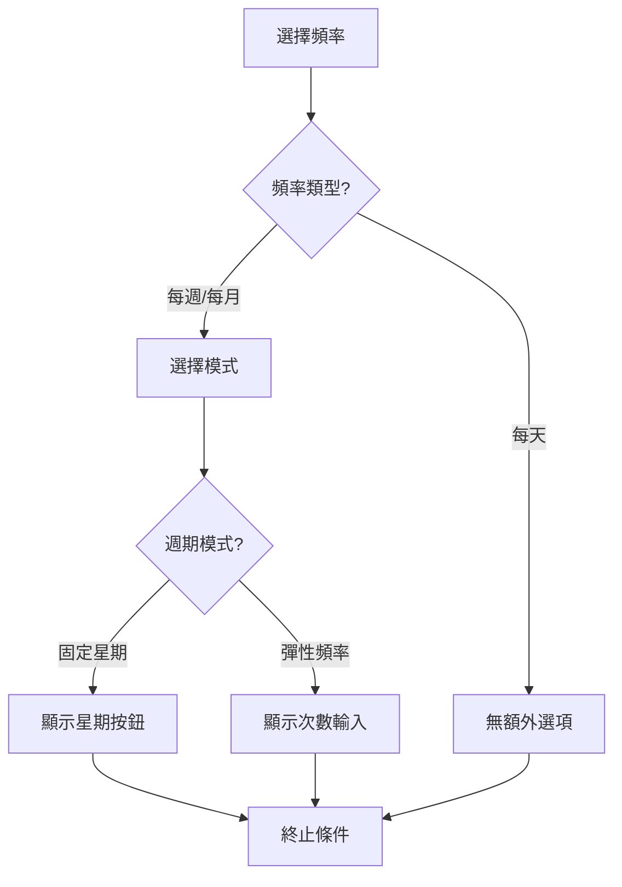

# Feature Spec: 005 - Recurrence System

## 1. Overview
習慣/任務的重複週期系統，支援兩種主要模式：
- **固定星期模式** (Fixed Days)：指定每週的特定日期執行
- **彈性頻率模式** (Flexible Frequency)：每個週期內達成目標次數即可

---

## 2. 週期類型 (Frequency Type)

| 類型 | 值 | 說明 |
|------|-----|------|
| 每天 | `daily` | 每天執行一次 |
| 每週 | `weekly` | 每週執行，可選固定/彈性模式 |
| 每月 | `monthly` | 每月執行，可選固定/彈性模式 |

---

## 3. 兩種週期模式（互斥）

### 3.1 固定星期模式 (weekMode: 'fixed')

**說明**：用戶必須在指定的星期幾執行任務

**資料結構**：
```typescript
recurrence: {
  type: 'weekly',
  weekMode: 'fixed',       // 固定星期模式
  weekDays: [1, 3, 5],     // 0=日, 1=一, 2=二... 6=六
  endType: 'never' | 'count',
  endCount?: number
}
```

**UI 顯示**：星期按鈕可多選（日、一、二、三、四、五、六）

**範例**：
- 每週一、三、五運動 → `weekDays: [1, 3, 5]`
- 每週末休息 → `weekDays: [0, 6]`

---

### 3.2 彈性頻率模式 (weekMode: 'flexible')

**說明**：用戶在一個週期內達成目標次數即可，不限定日期

**資料結構**：
```typescript
recurrence: {
  type: 'weekly',          // 或 'monthly'
  weekMode: 'flexible',    // 彈性頻率模式
  periodTarget: 3,         // 每週期目標次數
  endType: 'never' | 'count',
  endCount?: number
}
```

**UI 顯示**：數字輸入框「每週 X 次」

**範例**：
- 每週運動 3 次（不限哪天）→ `periodTarget: 3`
- 每月閱讀 4 次 → `type: 'monthly', periodTarget: 4`

---

## 4. 完整資料結構

```typescript
interface Recurrence {
  // 基本週期
  type: 'daily' | 'weekly' | 'monthly';
  interval?: number;        // 間隔（每 X 天/週/月），預設 1
  
  // 週期模式（weekly/monthly 時使用）
  weekMode?: 'fixed' | 'flexible';
  
  // 固定模式專用
  weekDays?: number[];      // 0-6，週日=0
  
  // 彈性模式專用
  periodTarget?: number;    // 每週期目標次數
  
  // 終止條件
  endType: 'never' | 'count';
  endCount?: number;        // endType='count' 時有效
}
```

---

## 5. UI 邏輯流程



---

## 6. UI 設計規範

### 6.1 週期模式選擇器

當選擇「每週」或「每月」時，必須先選擇模式：

```
◉ 固定日期 - 每週固定在特定星期執行
○ 彈性次數 - 每週達成 X 次即可
```

### 6.2 固定日期模式 UI

```
指定星期：
[日] [一] [二] [三] [四] [五] [六]
      ✓         ✓         ✓
```

### 6.3 彈性次數模式 UI

```
每週目標：[ 3 ] 次
```

### 6.4 終止條件 UI

```
終止條件：
◉ 永不終止
○ 重複 [ 10 ] 次後終止
```

---

## 7. 驗證規則

| 模式 | 驗證 |
|------|------|
| fixed | `weekDays` 必須至少選擇 1 天 |
| flexible | `periodTarget` 必須 >= 1 |
| daily | 無額外驗證 |
| endType='count' | `endCount` 必須 >= 1 |

---

## 8. 預設值

```typescript
const defaultRecurrence = {
  type: 'daily',
  interval: 1,
  weekMode: 'fixed',
  weekDays: [],
  periodTarget: 1,
  endType: 'never',
  endCount: 10
};
```

---

## 9. 使用位置

| 位置 | 說明 |
|------|------|
| TaskFormModal | 客戶端/專家建立任務時的重複設定 |
| 習慣庫管理 | 專家定義官方習慣的預設重複設定 |
| 模板任務 | 模板內任務的重複設定 |

---

## 10. 相容性

### 舊資料遷移
舊資料可能沒有 `weekMode` 欄位：
- 有 `weekDays` 且長度 > 0 → 視為 `fixed`
- 有 `periodTarget` 且 > 0 → 視為 `flexible`
- 都沒有 → 預設 `fixed`

---

## 12. 階段優先原則 (Phase Priority)

> [!IMPORTANT]
> 當習慣從習慣庫匯入到計畫模板時，**階段時間長度** 會覆蓋習慣的終止條件設定。

### 12.1 優先順序

| 層級 | 設定 | 優先順序 |
|------|------|----------|
| 階段 (Phase) | `durationDays` | **最高** |
| 習慣設定 | `endType` / `endCount` | 次要 |

### 12.2 範例

```
習慣庫設定: endType = 'never'
模板階段設定: durationDays = 14

結果: 任務在階段結束時終止（14天後）
```

### 12.3 設計理由

1. **結構化計畫**：專家設計的計畫有明確的階段性目標
2. **漸進式挑戰**：不同階段可安排不同難度版本
3. **避免重疊**：防止多個階段的習慣互相重疊

### 12.4 實作位置

| 檔案 | 說明 |
|------|------|
| `/api/user/assignments/route.js` | 用戶自行加入模板 |
| `/api/admin/assignments/route.js` | 專家指派模板給用戶 |

### 12.5 實作程式碼

```javascript
// 1. 計算任務結束日期
const taskStartDate = new Date(phaseStartDate);
const phaseDays = phaseDays || 7;
const taskEndDate = new Date(taskStartDate);
taskEndDate.setDate(taskEndDate.getDate() + phaseDays - 1);
const endDateStr = taskEndDate.toISOString().split('T')[0];

// 2. 覆蓋 recurrence 設定
const recurrence = {
    ...(taskData.recurrence || {}),
    endType: 'date',        // 覆蓋 'never' 或 'count'
    endDate: endDateStr     // 階段結束日期
};

// 3. 儲存到 metadata
metadata: {
    phaseId,
    phaseName,
    phaseOrder,
    phaseDays,
    phaseStartDate,
    phaseEndDate: endDateStr  // 新增
}
```

---

## 13. 狀態
- [x] 文件定義
- [x] 更新習慣庫 UI（互斥選擇器）
- [x] 更新 TaskFormModal（templateMode 支援）
- [x] 更新模板任務編輯器
- [x] 實作階段優先原則（Phase Priority）
